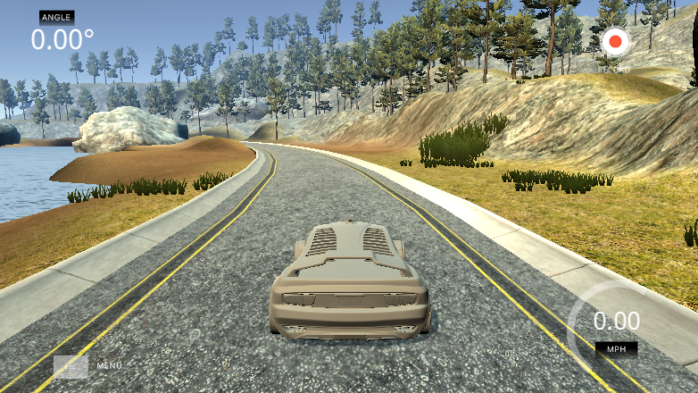
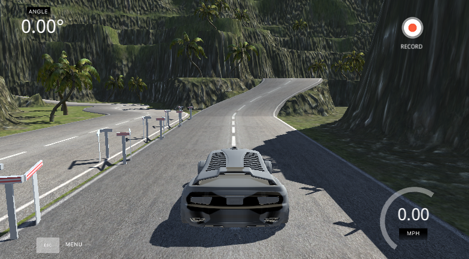
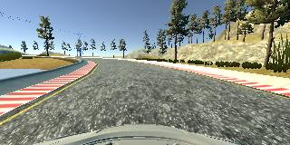
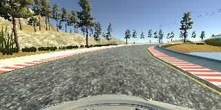

# **Behavioral Cloning** 

### The goals / steps of this project are the following:
* Use the simulator to collect data of good driving behavior
* Build, a convolution neural network in Keras that predicts steering angles from images
* Train and validate the model with a training and validation set
* Test that the model successfully drives around track one without leaving the road
* Summarize the results with a written report

### Model Architecture and Training Strategy

My model consists of a convolution neural network with 5x5 and 3x3 filter sizes and depths between 24 and 64 (model.py lines 23-27) 

This network is based on [The NVIDIA model](https://devblogs.nvidia.com/parallelforall/deep-learning-self-driving-cars/), which has been proven to work pretty well for this job.

The model includes RELU layers to introduce nonlinearity (code line 23), and the data is normalized in the model using a Keras lambda layer (code line 21). 

#### Attempts to reduce overfitting in the model

The model contains dropout layers in order to reduce overfitting (model.py lines 28). 

The model was trained and validated on different data sets to ensure that the model was not overfitting. The model was tested by running it through the simulator and ensuring that the vehicle could stay on the track.

#### Model parameter tuning

The model used an adam optimizer but the learning rate was tuned manually to 0.0001 (model.py line 68).

#### Appropriate training data

Training data was chosen to keep the vehicle driving on the road. I used a combination of center lane driving from both tracks, I drive the car in the other direction and repeated 2 times the harder parts. 

For details about how I created the training data, see the next section. 

### Model Architecture and Training Strategy

#### Solution Design Approach

The overall strategy for deriving a model architecture was to try and fail until I get the desired result. 

My first step was to use a convolution neural network model similar to the The NVIDIA model I thought this model might be appropriate because they used for the same problem and they got I good result.

In order to gauge how well the model was working, I split my image and steering angle data into a training and validation set. I found that my first model had a low mean squared error on the training set but a high mean squared error on the validation set. This implied that the model was overfitting. 

To combat the overfitting, I modified the model by adding a Dropout layer after the last convolution and by adding an activation in the fully connected layers.

Then I trained the model with different learning rates until I get a good performance.

The final step was to run the simulator to see how well the car was driving around track one. There were a few spots where the vehicle fell off the track. To improve the driving behavior in these cases, I collected more data by driving for these spots 2 o 3 times. 

At the end of the process, the vehicle is able to drive autonomously around the track without leaving the road.

#### Final Model Architecture

The final model architecture (model.py lines 20-33) consisted of a convolution neural network with the following layers and layer sizes:

* Lambda: Image normalization
* Cropping: Image cropping, (70 25)
* Convolution: 5x5 | filter: 24 | strides: 2x2 | activation: RELU
* Convolution: 5x5 | filter: 36 | strides: 2x2 | activation: RELU
* Convolution: 5x5 | filter: 48 | strides: 2x2 | activation: RELU
* Convolution: 3x3 | filter: 64 | activation: RELU
* Convolution: 3x3 | filter: 64 | activation: RELU
* Dropout (0.5)
* Fully connected: 100 | activation: RELU
* Fully connected:  50 | activation: RELU
* Fully connected:  10 | activation: RELU
* Fully connected:   1

#### Creation of the Training Set & Training Process

To capture good driving behavior, I first recorded two laps on track one using center lane driving, then I recorded one lap driving in the other way Here is an example image of center lane driving:

Then I repeated this process on track two in order to get more data points.

To augment the data sat, I also flipped images and angles in order to simulate driving in the other direction. For example, here is an image that has then been flipped:

  

After the collection process, I had 27.444 number of data points. 

I finally randomly shuffled the data set and put 20% of the data into a validation set. 

I used this training data for training the model. The validation set helped determine if the model was over or under fitting. The ideal number of epochs was 12.

### Videos 

This are the result of the model driving in the two tracks.

- [Lake Track - YouTube](https://youtu.be/L0oqPDxBQMQ)
- [Jungle Track - YouTube](https://youtu.be/Etpx6mCM9Bk)